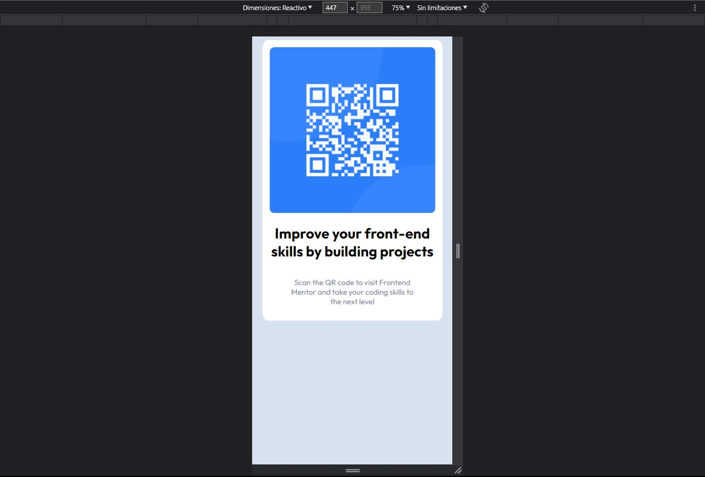

# Frontend Mentor - QR code component solution

This is a solution to the [QR code component challenge on Frontend Mentor](https://www.frontendmentor.io/challenges/qr-code-component-iux_sIO_H). Frontend Mentor challenges help you improve your coding skills by building realistic projects. 

## Table of contents

- [Overview](#overview)
  - [Screenshot](#screenshot)
  - [Links](#links)
- [My process](#my-process)
  - [Built with](#built-with)
  - [What I learned](#what-i-learned)
  - [Continued development](#continued-development)
- [Author](#author)

## Overview

### Screenshot

### Links

- Solution URL: https://github.com/Dabuaf86/staticQr
- Live Site URL: https://static-qr.vercel.app/

## My process

### Built with

- Semantic HTML5 markup
- CSS custom properties
- Flex
- CSS Grid
- Desktop-first workflow

### What I learned

I basically took this opportunity to practice some basic HTML, CSS, Grid and Flex skills

### Continued development

I definitely want to keep perfecting my design skills and practice until I totally control them.

## Author

- Website - https://github.com/Dabuaf86
- Frontend Mentor - [@Dabuaf86](https://www.frontendmentor.io/profile/Dabuaf86)
- LinkedIn - www.linkedin.com/in/daniel-abuaf-fullstack-dev
